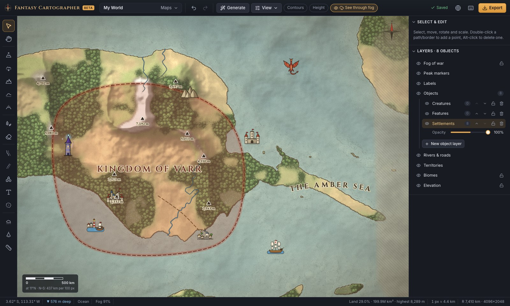

# Fantasy Cartographer

A free, self-hostable fantasy map editor that runs in your browser. Sculpt
continents and mountain ranges, paint forests and deserts, draw rivers, roads
and borders, place illustrated assets or your own artwork, and hide unexplored
lands under fog of war. Your maps stay on your computer.

> **Early beta (v1.0.0-beta.1).** It works and has been tested, but expect rough
> edges. Please back up maps you care about (see [Backups](#saving-backups-and-exports))
> and [report problems](#reporting-bugs-and-contributing).



## Features

- **Terrain sculpting.** Raise, lower, smooth and flatten terrain, and build
  mountain ranges, with adjustable radius (in km), strength, softness and edge
  roughness. Start from an empty ocean or generate continents, islands or
  archipelagos from a seed.
- **Real elevation.** Heights are stored in metres (up to 10,000 m by default)
  with a configurable sea level. Peaks are detected automatically and labelled
  with their height; you can name them. Contour lines and a height overlay are
  available.
- **A real planet.** The map is a whole planet (radius 7,410 km by default) that
  wraps around east–west. Brushes, the scale bar and the distance tool all use
  real kilometres.
- **Biomes.** Paint grassland, forest, farmland, desert, swamp, snow and rock
  with soft blended edges.
- **Rivers and roads.** Draw them freehand or point by point, then reshape them
  by dragging control points.
- **Objects.** Choose from 57 built-in illustrations: cities, castles, dragons,
  monsters, mountains, farms, mines, political and cultural sites, ships and
  more. You can also import your own PNG, WebP or SVG images. Place, stamp,
  move, rotate, scale, layer, lock and annotate them.
- **Political borders and labels.** Draw kingdoms, empires, republics,
  khaganates, tribal lands and independent cities, each with its own colours and
  border style. Add curved text labels.
- **Fog of war.** Paint areas hidden or revealed with soft edges, preview the
  player's view, and export a "players only" image.
- **Styles.** Choose parchment, fantasy atlas, clean political or shaded relief.
- **Local-first.** Maps save automatically in your browser. There's no account,
  no server-side storage and no tracking.

## Quick start with Docker

Requires [Docker](https://docs.docker.com/get-docker/) with Compose.

```bash
git clone https://github.com/mercurial20/loremapper.git
cd loremapper
docker compose up -d
```

Open **<http://localhost:8080>**.

- Use a different port: `FC_PORT=3000 docker compose up -d`
- Stop: `docker compose down` (your maps are **not** affected; see [Where your maps live](#where-your-maps-live))
- Update to a newer version: `git pull && docker compose up -d --build --force-recreate`

The container is a small nginx image that serves the pre-built static app. It
binds to `127.0.0.1` only. To reach it from other devices on your network,
change the `ports` entry in `compose.yaml` to `"8080:80"`.

## Installation without Docker

Requires [Node.js](https://nodejs.org) 22.12 or newer (Node 24 LTS recommended).

```bash
git clone https://github.com/mercurial20/loremapper.git
cd loremapper
npm ci
npm run build      # creates the static site in dist/
npm run preview    # serves it at http://localhost:4173
```

`dist/` is a plain static website. You can host it with any static web server
(nginx, Caddy and so on) at the root of a domain or port; no backend is needed.
Hosting under a sub-path such as `/maps/` is not supported in this beta.

For development with live reload, run `npm run dev` (<http://localhost:5173>).

## Using your own assets

1. Choose the **Place objects** tool (`O`) to open the asset library.
2. Click **Import PNG / WebP / SVG**, or drag image files onto the library panel.
   Images go into the selected category, or **Custom** if none is selected.
3. Click an asset and then click the map, or drag the asset onto the map.

Imported images are stored permanently in the browser, alongside your maps.
From an asset's **⋯** menu you can:

- **Rename** it or move it to another category. Create your own categories with
  the folder button.
- **Replace image…** to swap the artwork of any asset, including built-in ones.
  Every placed copy updates. **Restore original** undoes this for built-in assets.
- **Delete** your own assets, or **Hide** built-in ones. Objects already placed
  on a map are not deleted.

Transparent PNGs or SVGs about 256–512 px in size work best.

## Saving, backups and exports

**Saving is automatic.** Every change is written to your browser's storage about
a second later; the indicator at the top shows *Saved*. Use **Maps** to create,
open, rename, duplicate and delete maps.

**Export** offers three different things:

| Export | What it is | Can you keep editing it? |
| --- | --- | --- |
| **Map image** | A flattened PNG of the current view or the whole planet, up to 12,288 px wide. Choose the complete map or only the areas revealed through the fog. | No, it's just a picture. |
| **Heightmap** | A 16- or 8-bit greyscale PNG of the elevation, for game engines and 3D tools. | No. |
| **Editable project** | A `.fantasymap` file containing the terrain, objects, borders, labels, fog and the custom images the map uses. | **Yes.** Import it from **Maps → Import project file…** in any browser. |

**Back up important maps by exporting an editable project now and then.**
Browser storage can be cleared, for example by "clear browsing data", by
storage-saving settings, or when you uninstall the browser.

## Browser support and data persistence

You need a desktop browser with **WebGL 2** and a mouse or trackpad.

| Browser | Status in this beta |
| --- | --- |
| Chrome / Chromium | Tested (Chrome 154, macOS) |
| Firefox | Tested (Firefox 157, macOS). The console shows harmless WebGL notices. |
| Safari | Tested with the WebKit 27.2 engine (via Playwright), not with Safari itself. Reports welcome. |
| Edge, Opera, Brave | Expected to work (Chromium-based); not tested. |
| Phones and tablets | Not supported. |

Testing so far has been on macOS. Windows and Linux reports are especially
welcome.

### Where your maps live

Maps and imported assets are stored in your **browser's IndexedDB**, not on the
server and not in the Docker container:

- Data belongs to one **browser profile** and one **address (origin)**.
  `http://localhost:8080`, `http://localhost:5173` and `http://127.0.0.1:8080`
  are different origins, each with its own separate list of maps.
- Removing or rebuilding the Docker container does **not** delete maps. Changing
  the port or hostname makes them *appear* to vanish. Go back to the old address
  to find them, then move them with an exported project file.
- Other browsers and other computers do not see your maps. Use
  **Export → Editable project** to move a map.
- Private or incognito windows usually discard their storage when closed.

The app asks the browser to keep its storage persistent, but that is a request,
not a guarantee.

## Current beta limitations

- **Fixed resolution.** Each map's resolution is chosen when it's created:
  Standard (about 11 km per terrain cell) or High detail (about 5.7 km). Close
  zoom adds visual detail, but you can't sculpt features smaller than a cell.
  Painted biomes and fog use cells twice that size.
- Rivers and roads are drawn on top of the terrain; they don't carve valleys.
- Territories are independent shapes; neighbouring borders don't snap together.
- Undo history is lost when you reload the page or switch maps.
- Curved labels are selected using their straight outline.
- Project files of fully generated worlds are large (about 20–25 MB), because
  elevation is stored losslessly.
- Very large image exports (above about 160 megapixels) are disabled.
- Near the poles, brushes keep their true size in km, so they look very wide on
  the flat map.
- Desktop only; touch input is not supported.

## Reporting bugs and contributing

- **Bugs:** open an [issue](https://github.com/mercurial20/loremapper/issues/new/choose).
  Include the version (press `?` in the app), your browser and OS, the steps to
  reproduce, and any red errors from the browser console. An exported
  `.fantasymap` file helps a lot.
- **Ideas and questions:** feature requests are welcome. Please describe what
  you're trying to draw.
- **Code:** see [CONTRIBUTING.md](CONTRIBUTING.md). Before opening a pull
  request, run `npm run lint`, `npm run typecheck`, `npm test` and
  `npm run build`.

### Architecture

The app is TypeScript with React 19 for the interface, PixiJS 8 (WebGL 2) for
the map, Zustand for state and IndexedDB for storage. Vite builds it.

```
src/
  core/         planet constants, projection & distances, noise and geometry helpers
  terrain/      sparse tiled rasters (elevation, biomes, fog), brushes, peaks, world generator
  model/        document types, undo/redo, versioned project format
  store/        application state
  persistence/  IndexedDB storage for maps, tiles, assets and settings
  assets/       asset library and the built-in SVG asset pack
  render/       PixiJS renderer, GLSL terrain/fog shaders, vector layers
  tools/        mouse and keyboard handling for every tool
  editor/       glue code, commands, generation, import/export
  ui/           React components
```

The terrain is stored in 256×256-cell tiles, and only areas you have touched use
memory. Each tile is drawn by a shader on the GPU, and a brush stroke re-uploads
only the tiles it changed. The saved format is versioned
(`src/model/serialization.ts`), with a place for migrations.

The built-in artwork in `src/assets/starter/` is plain SVG generated in code. To
replace an image for yourself, use **Replace image…** in the app. To replace
the pack in the source, edit the entries in those files (each has an id, name,
category, tags and SVG).

## License and acknowledgements

Fantasy Cartographer is released under the [MIT License](LICENSE).

- Fonts: Cinzel, EB Garamond, IM Fell English and Inter, under the SIL Open
  Font License 1.1, bundled via [Fontsource](https://fontsource.org).
- Libraries: React, PixiJS, Zustand, idb, fflate and Lucide icons.

See [THIRD_PARTY_NOTICES.md](THIRD_PARTY_NOTICES.md) for details.

This project was inspired by
[Cartographer](https://github.com/PaulsGameDevHub/cartographer) by
PaulsGameDevHub and by tools such as [Inkarnate](https://inkarnate.com). It is
not affiliated with either. Cartographer has no open-source license, so no code,
data or artwork from it is included here; similar features were implemented
independently.
