<div align="center">


# Loremapper

**Draw the world your stories happen in.**

A free fantasy map editor that runs in your browser.<br/>
Sculpt real terrain, paint forests and deserts, draw rivers, roads and borders,<br/>
drop in castles and dragons, and hide the unexplored under fog of war.

[](CHANGELOG.md)
[](LICENSE)
[](https://mercurial20.github.io/loremapper/)
[](#b-docker)
[](#-where-your-maps-live)
[](#-a-non-commercial-project)

**[▶ Open the app](https://mercurial20.github.io/loremapper/)** · [Quick start](#-quick-start) · [First map in 5 minutes](#-your-first-map-in-5-minutes) · [Features](#-features) · [Saving & export](#-saving-backups-and-export) · [Report a bug](https://github.com/mercurial20/loremapper/issues/new/choose)

<br/>

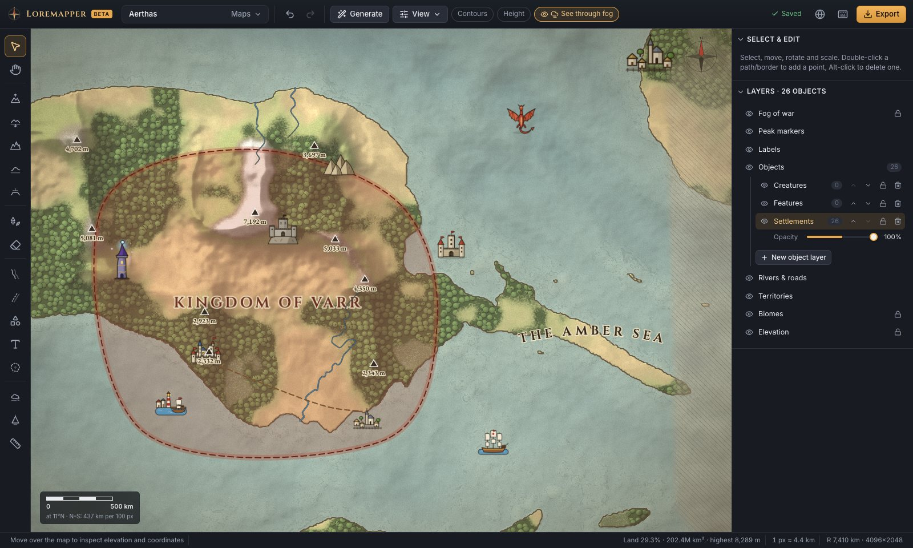

</div>

## ✨ Why Loremapper?

- **Terrain is real, not just painted.** Every point has an elevation in metres. Mountains cast shade, peaks label themselves ("7,192 m"), coastlines follow the sea level, and contour lines come for free.
- **Start from an empty ocean or a seed.** Sculpt by hand, or type a seed like `amber-drake-7` and get continents, rivers and climates in seconds. Then keep editing everything by hand.
- **Your art is welcome.** It ships with 57 illustrated map icons, and you can drop in your own PNG, WebP or SVG files. They stay in your library.
- **Built for game masters.** Paint fog of war over unexplored lands and export a player-safe version of the map.
- **Nothing leaves your computer.** There's no account and no cloud. Maps are saved automatically in your browser. Use it [online](https://mercurial20.github.io/loremapper/) with nothing to install, or run your own copy with one command.

<p align="center">
  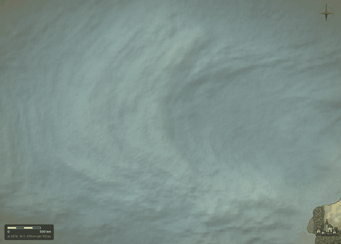<br/>
  <sub>Raising an island, building a mountain range, painting a forest and drawing a river: about 30 seconds of real editing.</sub>
</p>

## 💛 A non-commercial project

Loremapper is a hobby project made for the worldbuilding and tabletop community.
It is **not developed for commercial purposes**: there is no paid version, no
premium features, no ads, no tracking of you or your maps, and no plans to monetise it. The code is
open under the [MIT License](LICENSE).

> **Early beta.** Loremapper works and has been tested (see [Testing](#-testing-done-for-this-beta)), but expect rough edges.
> Please [back up](#-saving-backups-and-export) maps you care about and [tell us](#-reporting-bugs-and-contributing) what breaks.

---

## 🚀 Quick start

Pick the path that matches you. All of them end the same way: a browser tab
with the editor open.

| | Path | Good for | Time | You need |
|:-:|---|---|---|---|
| ⚡ | **[A. Open it online](#a-open-it-online--easiest)** | Trying it right now, or just using it. Nothing to install. | 0 min | A browser |
| 🟢 | **[B. Docker](#b-docker)** | Running your own copy offline with one command. | ~3 min | Docker Desktop |
| 🟡 | **[C. Node.js](#c-nodejs-without-docker)** | Your own copy without Docker. | ~3 min | Node.js 22+ |
| 🔵 | **[D. Developer mode](#d-developer-mode)** | Changing the code. | ~2 min | Node.js 22+, Git |
| ⚫ | **[E. Host it yourself](#e-host-it-yourself)** | Your own GitHub Pages site, NAS, home server or website. | ~10 min | A GitHub account or a web server |

### A. Open it online — easiest

### 👉 **[mercurial20.github.io/loremapper](https://mercurial20.github.io/loremapper/)**

That's it. The editor loads and runs **entirely in your browser**, and your maps
are saved in your browser too. This online copy is published automatically from
the `main` branch, so it always has the latest version.

> GitHub only delivers the app's files, like any website host. Your maps, images
> and edits are never uploaded anywhere. The online copy counts anonymous visits
> with Cloudflare Web Analytics; see [Privacy and analytics](#-privacy-and-analytics).

### B. Docker

Use this if you want your own copy that works offline.

**1. Install Docker Desktop** (one time) from [docker.com](https://www.docker.com/products/docker-desktop/) for Windows or macOS. On Linux, install [Docker Engine](https://docs.docker.com/engine/install/). Start it and wait until it says it's running.

**2. Get Loremapper.** Either:
- click the green **Code → Download ZIP** button on this page and unzip it, or
- if you use Git: `git clone https://github.com/mercurial20/loremapper.git`

**3. Start it.** Open a terminal in the unzipped folder and run:

```bash
docker compose up -d
```

> 💡 **How to open a terminal in a folder.** On **Windows**, open the folder in Explorer, right-click an empty area and choose **Open in Terminal**. On **macOS**, right-click the folder in Finder and choose **New Terminal at Folder**. On **Linux**, right-click and choose **Open in Terminal**.

The first start downloads and builds everything (1–3 minutes). When you see
`Container loremapper Started`, open **<http://localhost:8080>**. 🎉

<details>
<summary><b>Everyday Docker commands</b> (stop, update, change port, uninstall)</summary>

<br/>

| I want to… | Run this in the Loremapper folder |
|---|---|
| Stop it | `docker compose down` |
| Start it again | `docker compose up -d` |
| Use another port, e.g. 3000 (macOS/Linux) | `LOREMAPPER_PORT=3000 docker compose up -d` |
| Use another port, e.g. 3000 (Windows PowerShell) | `$env:LOREMAPPER_PORT=3000; docker compose up -d` |
| Update to a new version (Git) | `git pull` then `docker compose up -d --build --force-recreate` |
| Update to a new version (ZIP) | Download the new ZIP, then run `docker compose up -d --build --force-recreate` in the new folder |
| Uninstall | `docker compose down --rmi all`, then delete the folder |

Stopping, updating or uninstalling the container **does not delete your maps**.
They live in your browser ([why?](#-where-your-maps-live)). Changing the port
does hide them, because each address keeps its own maps.

The container only listens on your own computer (`127.0.0.1`). To open it from
other devices on your home network, change the `ports` line in `compose.yaml`
to `"8080:80"`.

</details>

### C. Node.js (without Docker)

**1.** Install [Node.js](https://nodejs.org) **22.12 or newer** (the LTS version is fine).<br/>
**2.** Download the project (ZIP or `git clone`, as in path B).<br/>
**3.** In a terminal inside the folder:

```bash
npm ci            # install dependencies (one time)
npm run build     # build the app
npm run preview   # serve it
```

Open **<http://localhost:4173>**. Stop it with <kbd>Ctrl</kbd>+<kbd>C</kbd>.

### D. Developer mode

```bash
git clone https://github.com/mercurial20/loremapper.git
cd loremapper
npm ci
npm run dev       # live-reloading editor at http://localhost:5173
```

Useful scripts: `npm test` (unit tests), `npm run lint`, `npm run typecheck` and
`npm run build`. See [CONTRIBUTING.md](CONTRIBUTING.md).

### E. Host it yourself

**Your own free copy on GitHub Pages**, updated every time you push:

1. Click **Fork** at the top of this page.
2. In your fork, open **Settings → Pages** and set **Source** to **GitHub Actions**.
3. Open the **Actions** tab and allow workflows to run.
4. Run **Deploy to GitHub Pages** (or push any change to `main`).
   After a minute or two your copy is live at `https://<your-name>.github.io/loremapper/`.

**On your own server.** `npm run build` produces a **static website** in
`dist/`; there's no backend and no database on the server. Copy `dist/` to any
static web server (nginx, Caddy, Apache…).
[`docker/nginx.conf`](docker/nginx.conf) is a working example with caching and
the single-page-app fallback. To serve from a sub-path such as
`example.com/maps/`, build with `BASE_PATH=/maps/ npm run build`.

Self-hosted copies and forks ship **without analytics**. If you want
[Cloudflare Web Analytics](https://developers.cloudflare.com/web-analytics/) on
your own copy, build with `CF_BEACON_TOKEN=<your site token>`, or set it as an
Actions variable named `CF_BEACON_TOKEN` in your fork.

<details>
<summary><b>🛠 Troubleshooting</b></summary>

<br/>

| Problem | What to do |
|---|---|
| `Cannot connect to the Docker daemon` | Docker Desktop isn't running. Start it, wait a moment, and try again. |
| `port is already allocated` | Something else uses port 8080. Start with another port (see the table above). |
| The page is empty or grey, or says WebGL is unavailable | Loremapper needs **WebGL 2**. Turn on hardware acceleration in your browser settings and update your graphics drivers. You can check your browser at [get.webgl.org/webgl2](https://get.webgl.org/webgl2/). |
| "My maps are gone!" | Open the **same browser** at the **exact same address** you used before (for example `http://localhost:8080`, not `127.0.0.1:8080`). The online version and your local copies keep separate maps. See [Where your maps live](#-where-your-maps-live). |
| "Saving failed" message | The browser storage may be full or disabled (private windows). Export your map right away with **Export → Editable project**. |
| `npm ci` fails | Check `node --version`. You need 22.12 or newer. |
| My fork's Pages site shows a 404 | Check that **Settings → Pages → Source** is **GitHub Actions** and that the **Deploy to GitHub Pages** workflow ran successfully. |

</details>

---

## 🗺 Your first map in 5 minutes

<table>
<tr>
<td width="50%">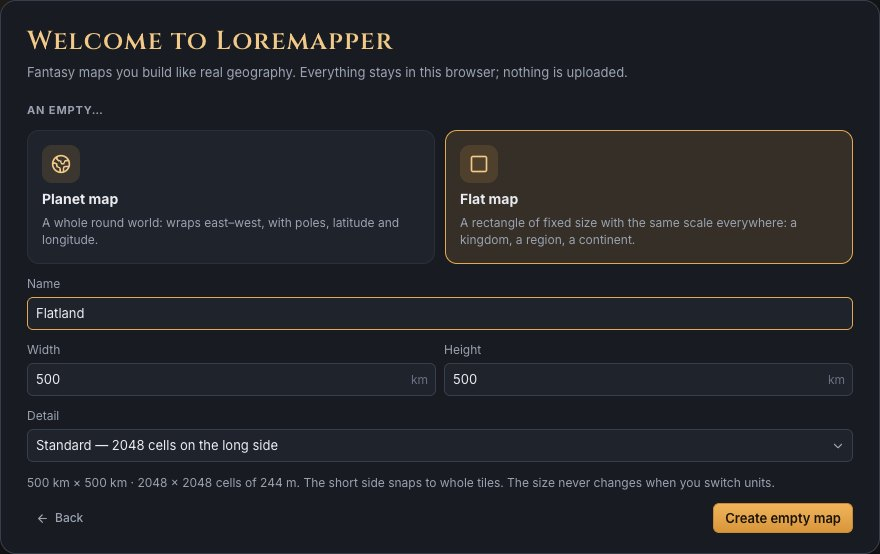</td>
<td><b>1. Create a world.</b><br/>Open <b>Maps → New map</b>. Name your world and choose its size: <b>Standard</b> (each terrain cell is ~11 km) or <b>High detail</b> (~5.7 km). You can also change the planet radius and the highest possible peaks. Every map starts as an open ocean.</td>
</tr>
<tr>
<td>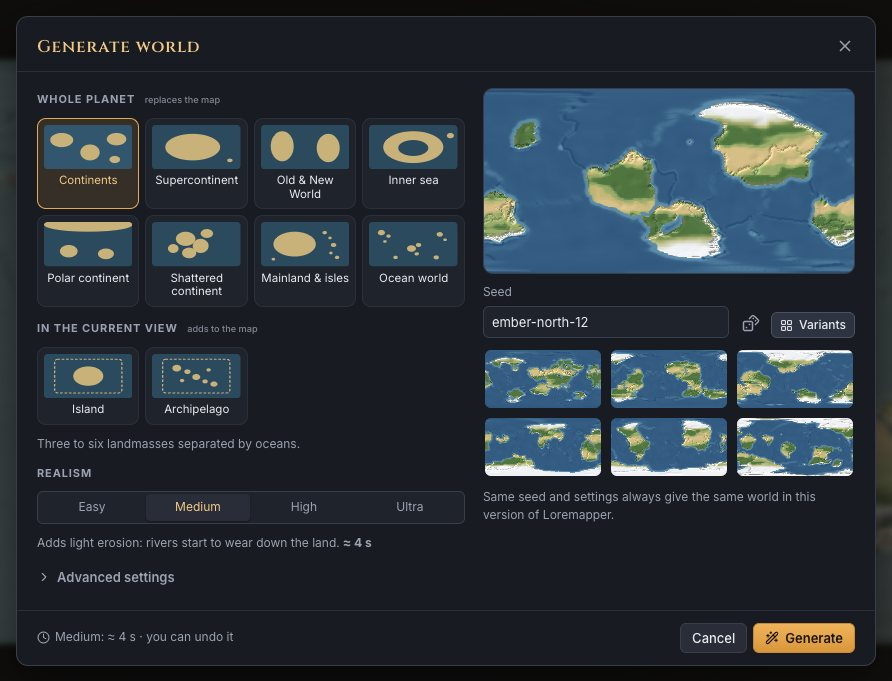</td>
<td><b>2. Generate or sculpt.</b><br/>Click <b>Generate</b> for continents, a supercontinent, an island or an archipelago. Type any <b>seed</b> (or roll the dice) and choose the land share, mountain height and ruggedness, plus optional biomes, rivers and named settlements. The same seed always gives the same world. Prefer full control? Press <kbd>R</kbd> and paint land yourself.</td>
</tr>
<tr>
<td>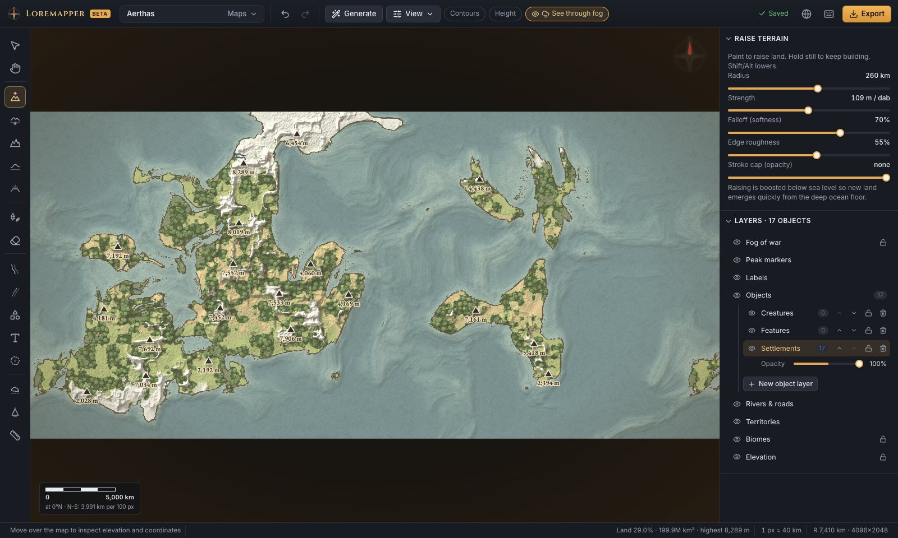</td>
<td><b>3. Explore your planet.</b><br/>Scroll to zoom and drag with the right mouse button (or hold <kbd>Space</kbd>) to pan. The world wraps around east to west, like a real globe. The bottom bar shows coordinates, elevation, biome and land share as you move.</td>
</tr>
<tr>
<td>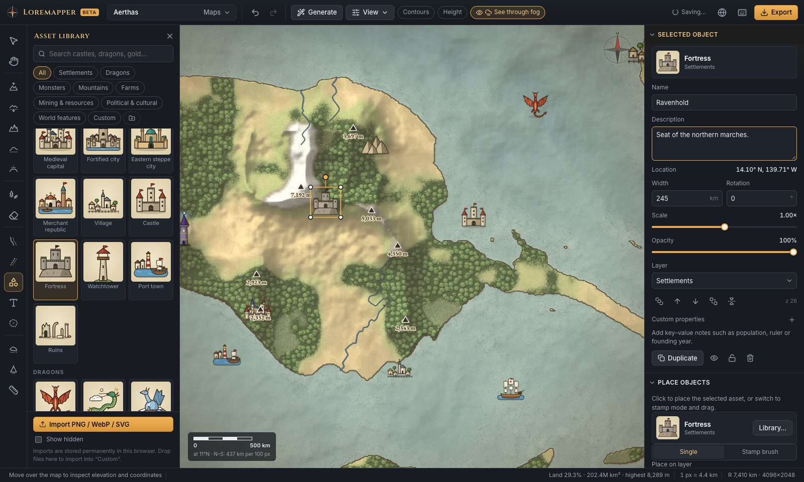</td>
<td><b>4. Place cities, castles and dragons.</b><br/>Press <kbd>O</kbd> to open the library. Search it, click an asset and click the map, or drag it onto the map. Select an object to move, rotate or scale it with handles, and to give it a name, a description and your own notes (population, ruler…).</td>
</tr>
<tr>
<td>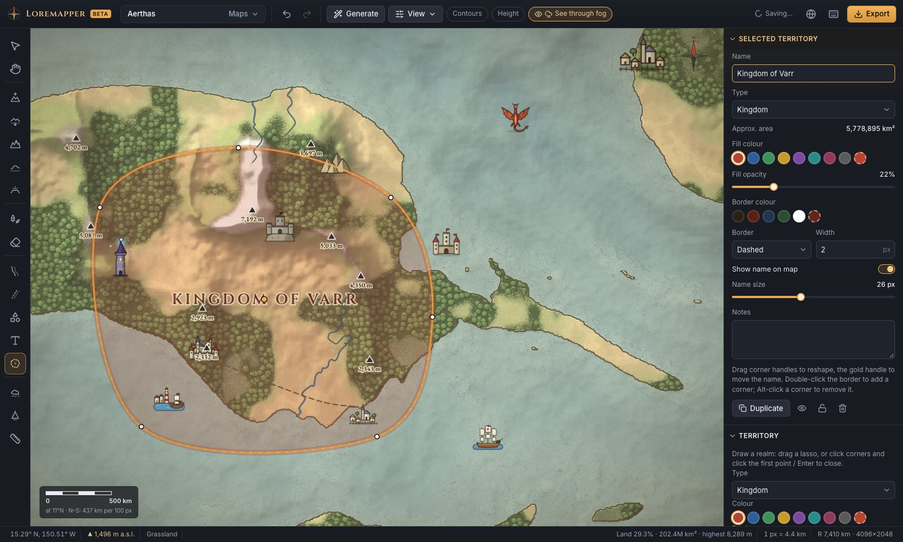</td>
<td><b>5. Draw borders and names.</b><br/>Press <kbd>G</kbd> and drag a lasso to draw a kingdom, empire, khaganate, republic, tribe or free city. Choose its colours and border style. Press <kbd>T</kbd> to write labels; they can curve along coasts.</td>
</tr>
<tr>
<td>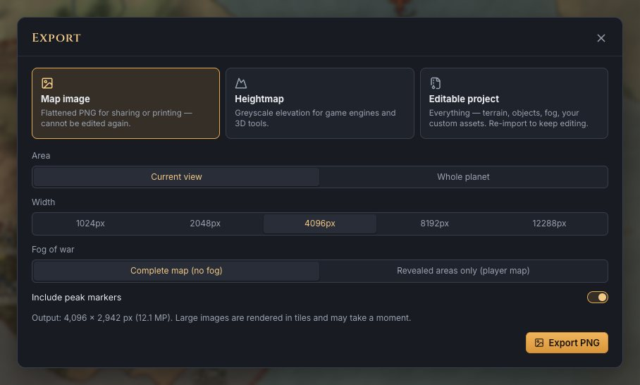</td>
<td><b>6. Share it.</b><br/><b>Export</b> a high-resolution PNG of the whole planet or of your current view, either complete or as the players' revealed-only version. Back up the editable project as a <code>.loremap</code> file.</td>
</tr>
</table>

---

## 🧭 Features

### Terrain you can feel

| | |
|---|---|
| **Brushes** | Raise <kbd>R</kbd>, Lower <kbd>L</kbd>, Mountain range <kbd>M</kbd>, Smooth <kbd>S</kbd> and Flatten <kbd>F</kbd>. Brush size is in kilometres. Strength, softness, a per-stroke height cap and ragged natural edges are all adjustable. Hold the mouse still to keep building. |
| **Elevation** | Heights are real metres (up to 10,000 m by default) with an adjustable sea level. Peaks are detected automatically; you can name them, mark them as significant or remove them. |
| **Biomes** | Grassland, forest, farmland, desert, swamp, snow and rock, with soft edges. Forests grow painted tree crowns and farmland becomes a patchwork of fields. |
| **Rivers & roads** | Draw them freehand or point by point, then drag the points to reshape them. Rivers taper towards the source; roads can be dashed, paved, dotted or double. |

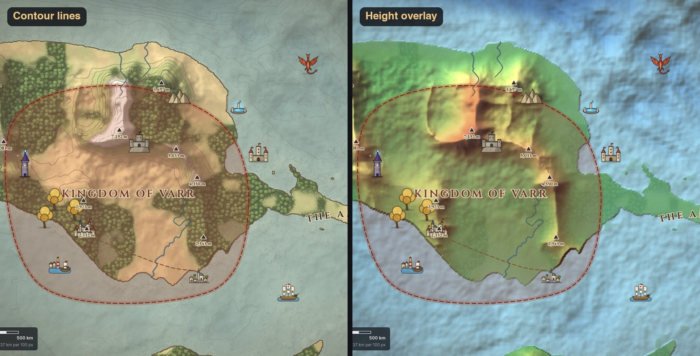

<table>
<tr>
<td width="50%">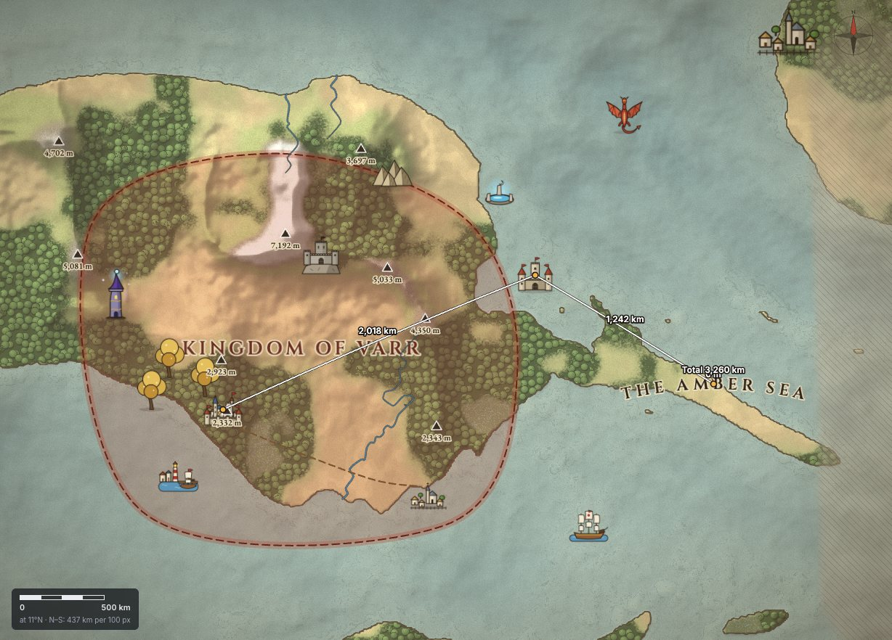</td>
<td><b>A real planet underneath.</b> The default world has a 7,410 km radius (about 690 million km²). Distances and the scale bar are measured on the sphere, so the ruler (<kbd>U</kbd>) gives honest kilometres even near the poles and across the date line.</td>
</tr>
</table>

### Your own art, kept forever

<table>
<tr>
<td width="55%">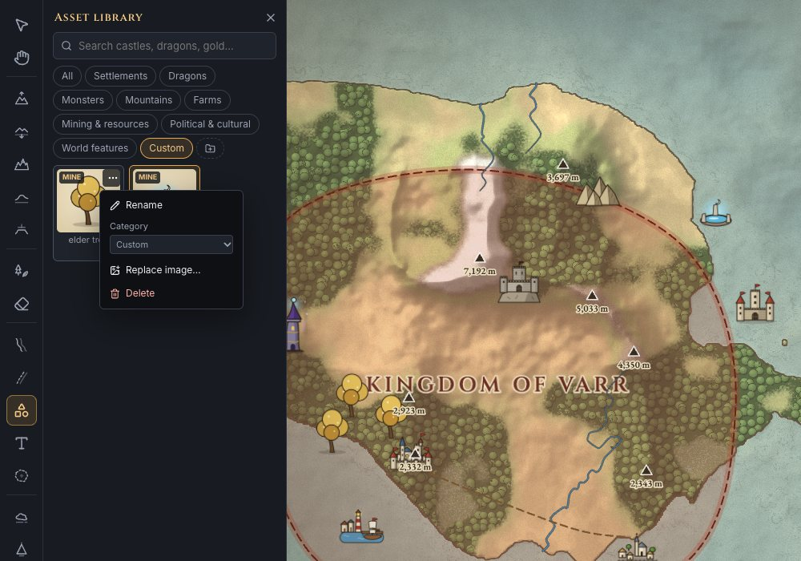</td>
<td>

1. Press <kbd>O</kbd> to open the asset library.
2. Click **Import PNG / WebP / SVG**, or **drag files** onto the panel.
3. Click your asset, then click the map.

Imports are stored in your browser and survive restarts. From the <b>⋯</b> menu you can rename an asset, move it to another category (make your own with the 📁 button), **replace the image** of any asset, built-in or yours (every copy on the map updates), or delete it. Deleting an asset never removes objects already on your maps.

Transparent PNGs or SVGs around 256–512 px look best.

</td>
</tr>
</table>

### Fog of war for game masters

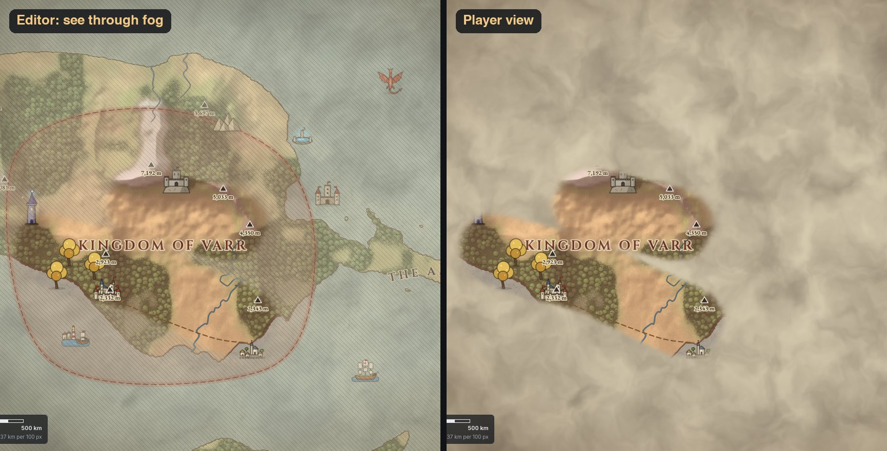

Press <kbd>X</kbd> and paint fog over unexplored lands, or reveal what the party
has discovered. Edges are soft and partial fog is possible. While editing you can
see through the fog; switch to **Player view** to check what players will see,
then export the **revealed areas only** image. Fog never changes anything
underneath it.

### Four looks, one map

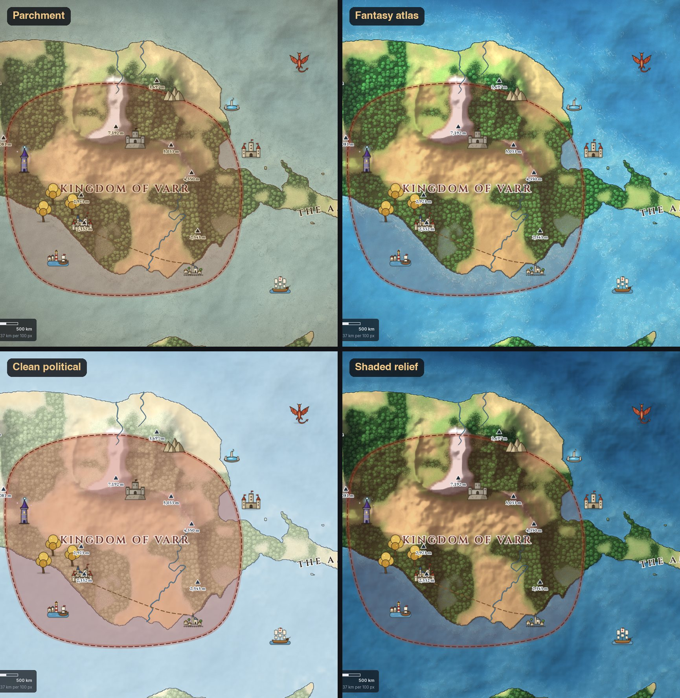

Switch styles any time from **View**: parchment, colourful fantasy atlas, clean
political or shaded relief. You can also toggle contour lines, the height
overlay, a latitude/longitude grid, peak markers and coastal ripples.

### Also included

- **Layers**: show, hide, lock and fade terrain, biomes, borders, rivers, objects, labels, peaks and fog. You can create your own object layers.
- **Undo / redo** for everything, plus copy, multi-select, z-order, lock and hide.
- **Many maps**: each is saved separately, with thumbnails, and can be renamed or duplicated.
- **Keyboard first**: press <kbd>?</kbd> in the app for all shortcuts.

<details>
<summary><b>⌨️ Tool shortcuts</b></summary>

<br/>

| Key | Tool | Key | Tool |
|:-:|---|:-:|---|
| <kbd>V</kbd> | Select & edit | <kbd>W</kbd> | River |
| <kbd>H</kbd> | Pan | <kbd>D</kbd> | Road |
| <kbd>R</kbd> | Raise terrain | <kbd>O</kbd> | Place objects |
| <kbd>L</kbd> | Lower terrain | <kbd>T</kbd> | Label |
| <kbd>M</kbd> | Mountain range | <kbd>G</kbd> | Territory |
| <kbd>S</kbd> | Smooth | <kbd>X</kbd> | Fog of war |
| <kbd>F</kbd> | Flatten | <kbd>P</kbd> | Peaks |
| <kbd>B</kbd> | Paint biome (<kbd>1</kbd>–<kbd>7</kbd> pick one) | <kbd>U</kbd> | Measure |
| <kbd>E</kbd> | Eraser | <kbd>[</kbd> <kbd>]</kbd> | Brush size |

<kbd>Ctrl</kbd>/<kbd>⌘</kbd>+<kbd>Z</kbd> undo · <kbd>Ctrl</kbd>+<kbd>Shift</kbd>+<kbd>Z</kbd> redo · <kbd>Ctrl</kbd>+<kbd>D</kbd> duplicate · <kbd>Delete</kbd> remove · hold <kbd>Shift</kbd> or <kbd>Alt</kbd> while painting to invert a brush

</details>

---

## 💾 Saving, backups and export

**Saving is automatic.** About a second after each change, the top bar shows ✓ *Saved*.

<table>
<tr>
<td width="45%">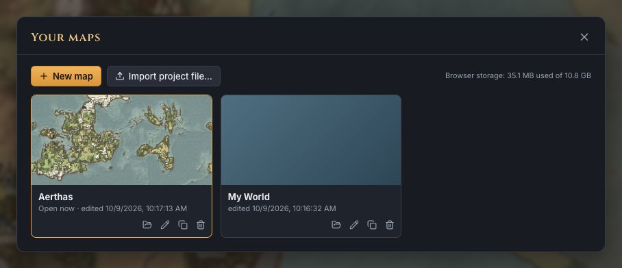</td>
<td>

| Export | What you get | Editable later? |
|---|---|:-:|
| **Map image** | PNG up to 12,288 px wide: current view or whole planet, complete or revealed-only | ✗ |
| **Heightmap** | 16- or 8-bit greyscale PNG of the elevation, for game engines and 3D tools | ✗ |
| **Editable project** | A `.loremap` file with everything, including your custom images | ✓ |

</td>
</tr>
</table>

> 🛟 **Make backups.** Browser storage can be wiped by "Clear browsing data",
> by cleanup tools or by reinstalling the browser. Now and then, use
> **Export → Editable project** and keep the `.loremap` file somewhere safe.
> Restore it from **Maps → Import project file…**, in any browser or on any computer.

## 🔒 Where your maps live

Maps and imported images are stored in **your browser** (IndexedDB), not on the
server and not inside the Docker container.

- Each **browser** and each **address** keeps its own maps.
  The online version (`mercurial20.github.io`), `http://localhost:8080`,
  `http://127.0.0.1:8080` and `http://localhost:4173` are four separate places.
- Rebuilding, updating or deleting the container does **not** touch your maps.
- To move a map to another browser or computer, export it as an editable project
  and import it there.
- Private or incognito windows usually forget everything when they close.

## 📊 Privacy and analytics

The official online version at
[mercurial20.github.io/loremapper](https://mercurial20.github.io/loremapper/)
uses [Cloudflare Web Analytics](https://www.cloudflare.com/web-analytics/) to
count visits, see where visitors come from (referrers, countries) and measure page
load speed. It doesn't use cookies or local storage. This is only so we can see
whether people find the project useful.

- Analytics only sees that the page was opened. Your maps, map names, drawings,
  imported images, tool usage and projects are **never sent** anywhere. They stay
  in your browser.
- If the analytics script is blocked (for example by an ad blocker), Loremapper
  works exactly the same.
- Docker, Node.js and self-hosted copies, and forks, include **no analytics** at all.

## 🌐 Browser support

You need a desktop browser with **WebGL 2**, and a mouse or trackpad.

| Browser | Status |
|---|---|
| Chrome / Chromium | ✅ Tested (Chrome 154, macOS) |
| Firefox | ✅ Tested (Firefox 157, macOS). The console shows harmless WebGL notices. |
| Safari | 🟡 Tested with its engine, WebKit 27.2, but not with the Safari app itself |
| Edge, Opera, Brave | 🟡 Expected to work (Chromium-based), not tested yet |
| Phones and tablets | ❌ Not supported |

So far testing has been on macOS. Windows and Linux reports are very welcome.

## 🚧 Current beta limitations

- A map's resolution is chosen when it's created and can't be changed later. You can't sculpt details smaller than one terrain cell (~11 km on Standard); biome paint and fog use cells twice that size.
- Rivers and roads sit on top of the terrain; they don't carve valleys.
- Neighbouring borders don't snap together.
- Undo history is cleared when you reload the page or switch maps.
- Curved labels are selected using their straight outline.
- Project files of fully generated worlds are large (about 20–25 MB).
- Very large image exports (over ~160 megapixels) are disabled.
- Near the poles, brushes keep their real size in km, so they look very wide on the flat map.
- Desktop only, with no touch support yet.

## ✅ Testing done for this beta

- A clean install from a fresh clone, with lint, type-check, 20 unit tests and the production build all passing.
- `docker compose up -d` starts the app on `localhost:8080`, and a build served from the GitHub Pages sub-path (`/loremapper/`) passes the same checks.
- Automated browser runs in Chrome, Firefox and WebKit covered:
  - painting terrain and biomes;
  - placing and editing objects;
  - importing PNG and SVG assets and replacing artwork;
  - reloading, with maps, assets and the camera all restored;
  - all three exports and re-importing a project;
  - switching maps.

  The runs produced no console errors and no requests to any outside server.

## 🐞 Reporting bugs and contributing

- **Found a bug?** [Open an issue](https://github.com/mercurial20/loremapper/issues/new/choose). The form asks for your app version (press <kbd>?</kbd> in the app), browser, OS and the steps to reproduce. A screenshot or an exported `.loremap` file helps a lot.
- **Have an idea?** Feature requests are welcome. Please describe what you're trying to draw, not only the button you want.
- **Want to code?** Read [CONTRIBUTING.md](CONTRIBUTING.md). Before opening a pull request, run `npm run lint`, `npm run typecheck`, `npm test` and `npm run build`.

<details>
<summary><b>🏗 How it's built</b></summary>

<br/>

The app is TypeScript with **React 19** for the interface, **PixiJS 8 (WebGL 2)**
for the map, **Zustand** for state and **IndexedDB** for storage. **Vite**
builds it, and the Docker image serves it with **nginx**.

```
src/
  core/         planet constants, projection & distances, noise and geometry helpers
  terrain/      sparse tiled rasters (elevation, biomes, fog), brushes, peaks, world generator
  model/        document types, undo/redo, versioned project format
  store/        application state
  persistence/  IndexedDB storage for maps, tiles, assets and settings
  assets/       asset library and the built-in SVG asset pack
  render/       PixiJS renderer, GLSL terrain/fog shaders, vector layers
  tools/        mouse and keyboard handling for every tool
  editor/       glue code, commands, generation, import/export
  ui/           React components
```

The terrain is stored in 256×256-cell tiles, and only areas you've touched use
memory. Shaders draw each tile on the GPU, and a brush stroke re-uploads only
the tiles it changed. The saved format is versioned
(`src/model/serialization.ts`). The built-in art in `src/assets/starter/` is
plain SVG generated in code and can be swapped freely.

</details>

## 📜 License and acknowledgements

Loremapper is released under the [MIT License](LICENSE) as a free,
non-commercial hobby project.

- Fonts: Cinzel, EB Garamond, IM Fell English and Inter, under the SIL Open
  Font License 1.1, bundled via [Fontsource](https://fontsource.org).
- Libraries: React, PixiJS, Zustand, idb, fflate and Lucide icons.

See [THIRD_PARTY_NOTICES.md](THIRD_PARTY_NOTICES.md) for details.

Inspired by [Cartographer](https://github.com/PaulsGameDevHub/cartographer) by
PaulsGameDevHub and by [Inkarnate](https://inkarnate.com). Loremapper is not
affiliated with either. Cartographer has no open-source license, so no code,
data or artwork from it is included; similar ideas were implemented
independently.

<div align="center"><sub>Made with ☕ for worldbuilders, game masters and map nerds.</sub></div>
